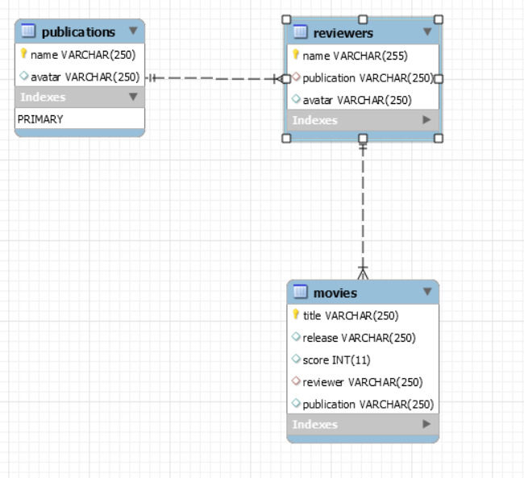

# movie-analyst-api
API for the movie analyst application of the devops ramp up

In order to deploy this application you will need to deploy a mysql database, and build the following schema:

Bear in mind that you would need to pass the connection data to the application for it to work, check the code, the environment variables are there :D

## Attributions
Application developed based on this post https://scotch.io/tutorials/building-and-securing-a-modern-backend-api

## Requirements

The project has been runned with nodejs version 10.19.0 and npm 6.14.4.
You can use another versions, but it's not guaranted to work the same way.

## How to run

Before running, you have to set the environments variables.
As example, in linux:
>   export DB_HOST=localhost

>   export DB_USER=root

>   export DB_PASS=laralara

>   export DB_NAME=movie_db

>   export BACKEND_PORT=3000

Then, install the required dependencies of the project:
>   npm install

Run the application
>   npm start

Run the test
>   npm test

